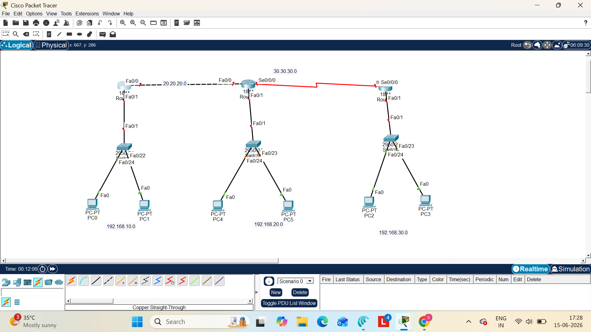

# Multi-Router Enterprise Network using RIP v2

## Project Overview

This project demonstrates the implementation of a multi-branch enterprise network using RIP Version 2 dynamic routing in Cisco Packet Tracer.

## Network Topology

- 3 Routers
- 3 Switches
- 6 PCs

## Objectives

- Configure IP addressing
- Configure RIP Version 2
- Advertise all networks
- Verify routing tables
- Test end-to-end connectivity

## Technologies Used

- Cisco Packet Tracer
- RIP Version 2
- IPv4 Addressing
- Routing and Switching

## Skills Demonstrated

- Routing
- RIP v2
- Network Troubleshooting
- IP Addressing
- Cisco CLI

## Project Outcome

Successfully established communication between multiple branch office networks through RIP v2 dynamic routing, allowing automatic route learning and seamless connectivity.

## Network Topology Screenshot



## Verification Commands

```bash
show ip route
show ip protocols
ping <destination-ip>
tracert <destination-ip>
```

## Author

Swetha Iruvuri
Aspiring Network Engineer
